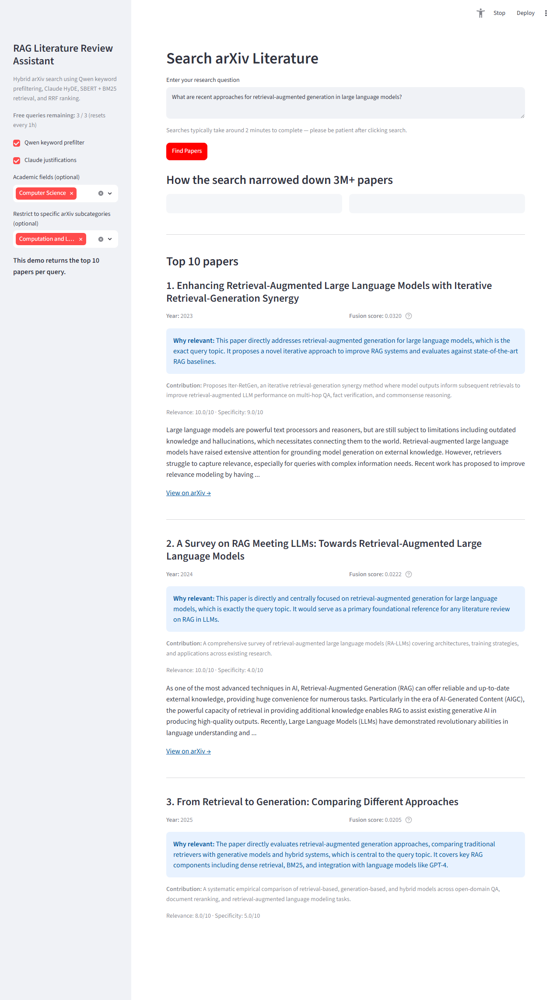

# RAGLR-A — RAG Literature Review Assistant (Demo)

[](LICENSE)

A domain-general arXiv retrieval system built to explore multi-stage RAG pipelines for academic literature search. RAGLR-A combines sparse and dense retrieval with LLM-powered query expansion and relevance justification to surface relevant papers from across the full arXiv taxonomy (3M+ papers).

---

## Demo



A short screen recording of a live query (including the academic field / arXiv subcategory filter from issue #10) is on [YouTube](https://youtu.be/kC1A5SCq2cs).

**This project isn't hosted as a live demo — that's a deliberate trade-off, not a limitation of the system.** The corpus is 3M+ arXiv papers backed by ~40GB of dense (ChromaDB), BM25, and keyword indexes, plus a locally-run Qwen2.5-0.5B model. Keeping that footprint warm for occasional traffic isn't worth it for a portfolio project, and a real query still takes **1-2 minutes end to end** on CPU (see [Limitations](#limitations)) — closer to a genuine literature-search workload than a snappy hosted demo would suggest.

If you don't want to run and build the indexes yourself — building the full dense index alone can take **overnight** (~24-28 hours on CPU, see [Build indexes](#4-build-indexes)) — the recording above walks through a query end-to-end. Otherwise, see [Running it yourself](#running-it-yourself) below.

---

## Architecture

Each query flows through the following stages:

1. **Qwen keyword prefilter** — a local Qwen2.5-0.5B-Instruct model extracts up to 18 search keywords and intersects them against a prebuilt inverted index, reducing the candidate pool before expensive retrieval
2. **Claude HyDE** — Claude Sonnet generates a hypothetical paper abstract representing an ideal result; this is used as the dense query vector (runs in parallel with step 1)
3. **Dual retrieval** — SBERT (all-MiniLM-L6-v2) dense retrieval via ChromaDB and BM25 sparse retrieval run in parallel over the candidate set
4. **Reciprocal Rank Fusion** — results from both retrievers are fused using RRF (k=60) to produce a single ranked list
5. **Claude justifications** — for each top-k result, Claude Sonnet generates a structured relevance justification: contribution summary, relevance reasoning, and relevance/specificity scores (1–10)

Every response also includes a `RetrievalTrace`: search-space reduction stats, latency breakdowns, and the keywords generated along the way.

### Interfaces
- **Streamlit UI** — query input, progress tracking, optional academic field / arXiv subcategory filtering, and results display
- **FastAPI REST server** — `/search` endpoint with interactive docs
- **CLI runner** — `scripts/run_query.py` for quick ad-hoc queries

### Data pipeline
- OAI-PMH harvester (`scripts/update_arxiv_data.py`) with incremental update support and recovery
- JSONL preprocessing and multi-index build (dense, BM25, keyword, metadata)

### Models used

| Role | Model |
|---|---|
| Keyword extraction | Qwen/Qwen2.5-0.5B-Instruct (local) |
| Dense embeddings | sentence-transformers/all-MiniLM-L6-v2 (local) |
| HyDE query expansion | claude-sonnet-4-6 (API) |
| Relevance justification | claude-sonnet-4-6 (API) |

---

## Corpus coverage

The harvested corpus spans the full arXiv taxonomy: Computer Science · Mathematics · Physics · Astrophysics · Condensed Matter · High Energy Physics · Nuclear Physics · Nonlinear Sciences · Statistics · Quantitative Biology · Quantitative Finance · Economics · Electrical Engineering and Systems Science · Other Physics

---

## Evaluation

RAGLR-A is evaluated against a 26-query gold set (20 CS/ML + 2 biology + 2 math + 2 physics) with hand-curated known-relevant `arxiv_id`s, run through the real pipeline at `top_k=10`. Highlights from the latest run:

| Metric | Result |
|---|---|
| Prefilter recall (keyword filter rarely drops a known-relevant paper) | 0.990 |
| End-to-end Precision@10 / Recall@10 / NDCG@10 / MRR | 0.154 / 0.385 / 0.375 / 0.599 |
| Justifier decoy-discrimination gap (top-k vs. random papers) | 8.04 / 10 |

See **[docs/EVALUATION.md](docs/EVALUATION.md)** for the full methodology, the gold query set, HyDE-vs-raw-query ablation results, and per-query breakdowns.

---

## Limitations

- **Dense retrieval cold-start latency** — on the full 3.07M-paper corpus, the first query in a process pays a ~60-70s one-time cost for ChromaDB to load its HNSW index from disk, dominating total query latency for short-lived processes (e.g. the CLI)
- **Qwen keyword prefilter can return empty** — for some specific, well-formed queries the model emits a literal `[]`, skipping the keyword-based search-space reduction for that query (the rest of the pipeline still runs correctly over the full corpus)
- **Old foundational papers rank poorly** — decade-old vocabulary doesn't compete with modern phrasing on lexical (BM25) or semantic (dense) similarity
- **Small gold query set** (26 queries, 4 `relevant_ids` each) — metrics are a noisy lower bound on true recall
- **Lightweight embedding model** (`all-MiniLM-L6-v2`) may underperform on notation-heavy math/physics queries
- **BM25 tokenization** struggles with model names/acronyms (e.g. `GPT-4`, `BERT`) and math symbols
- **No citation graph or co-authorship modeling** — ranking is purely lexical + semantic similarity
- **Claude justification scores** aren't calibrated across queries; use for within-query ranking only
- **English-only** corpus and embedding model

See **[docs/LIMITATIONS.md](docs/LIMITATIONS.md)** for the full discussion.

---

## Project structure

```
RAGLR-A/
├── api/                    FastAPI REST server
├── app/                    Streamlit UI
├── artifacts/              Built indexes (gitignored — ~40GB)
├── configs/
│   └── config.yaml         Runtime configuration
├── data/
│   ├── raw/                Raw OAI-PMH snapshot (gitignored)
│   └── processed/          Cleaned paper JSONL (gitignored)
├── docs/
│   └── EVALUATION.md       Retrieval evaluation methodology and results
├── prompts/                Versioned prompt templates
├── scripts/
│   ├── update_arxiv_data.py     Harvest arXiv via OAI-PMH
│   ├── orchestrate_indexing.py  Build all indexes end-to-end
│   ├── build_bm25_index.py      Build BM25 index
│   ├── build_keyword_index.py   Build keyword inverted index
│   ├── build_dense_index_fast.py Build ChromaDB dense index
│   ├── build_metadata_db.py     Build SQLite metadata index
│   ├── incremental_update.py    Apply incremental data updates
│   ├── run_query.py             CLI query runner
│   └── run_scheduler.py         Scheduled incremental harvesting
├── src/rag_lit/            Core library
│   ├── config.py           Config loader
│   ├── schemas.py          Pydantic output schemas
│   ├── pipeline.py         End-to-end pipeline
│   ├── preprocessing.py    Candidate ID filtering
│   ├── keyword_index.py    Inverted index build/query
│   ├── metadata_db.py      SQLite metadata index
│   ├── qwen_prefilter.py   Qwen keyword extractor
│   ├── hyde.py             Claude HyDE
│   ├── dense_retriever.py  SBERT + ChromaDB retriever
│   ├── bm25_retriever.py   BM25 retriever
│   ├── rrf.py              Reciprocal Rank Fusion
│   ├── justifier.py        Claude relevance justifier
│   └── rate_limiter.py     Demo rate limiting
└── tests/                  Unit and smoke tests
    └── eval/               Gold query set for retrieval evaluation
```

---

## Running it yourself

### 1. Install dependencies

```bash
pip install -r requirements.txt
pip install -e .
```

The second command installs `src/rag_lit` in editable mode so that `from src.rag_lit...` imports work regardless of the current working directory or how a script is invoked.

### 2. Configure API keys

Create a `.env` file in the project root:

```
ANTHROPIC_API_KEY=your_anthropic_api_key_here
```

### 3. Harvest arXiv data

Test run (1,000 papers — recommended for trying this out):
```bash
python scripts/update_arxiv_data.py --max-records 1000
```

Full harvest (millions of records — takes time; be polite to arXiv):
```bash
python scripts/update_arxiv_data.py
```

Incremental update from last harvest:
```bash
python scripts/update_arxiv_data.py --incremental
```

### 4. Build indexes

```bash
python scripts/orchestrate_indexing.py
```

This builds the artifacts in `artifacts/`:
- `dense_index/` — ChromaDB vector store (SBERT embeddings)
- `bm25_index/` — BM25 index
- `keyword_index.sqlite3` — token → paper ID inverted index
- `metadata.sqlite3` — paper metadata index (categories, byte offsets)

### 5. Run the app

```bash
streamlit run app/streamlit_app.py
```

Enter a research question and click **Find Papers**. On the full 3M-paper corpus, expect roughly 1-2 minutes per query (see [Demo](#demo) above); a smaller corpus (e.g. the 1,000-paper test harvest) returns in seconds.

#### FastAPI server

```bash
uvicorn api.main:app --reload
```

Interactive docs at `http://localhost:8000/docs`.

**POST /search**
```json
{
  "query": "attention mechanisms in transformers",
  "top_k": 10,
  "use_qwen_prefilter": true,
  "use_claude_justification": true
}
```

#### CLI

```bash
python scripts/run_query.py \
  --query "graph neural networks for drug discovery" \
  --top-k 5
```

Add `--no-qwen` to skip keyword prefiltering, `--no-justification` to skip Claude scoring.

### 6. Run tests

```bash
# Unit tests — no data or API keys required
pytest tests/test_schemas.py tests/test_rrf.py tests/test_filters.py -v

# Pipeline smoke tests — uses mocks, no data or API keys required
pytest tests/test_pipeline_smoke.py -v
```

---

## License

[MIT](LICENSE)
